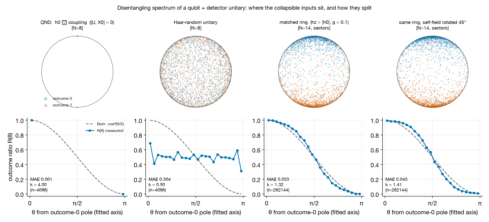

# Collapse and Chaos

**Measurement-like collapse and Born-rule statistics from unitary qubit–detector dynamics**

Research group of Prof. Ido Kaminer · Technion – Israel Institute of Technology

In its textbook formulation, quantum mechanics suspends unitary evolution at exactly one
place, measurement: the linear Schrödinger equation never produces a single definite outcome,
and the Born rule is postulated rather than derived. This project asks whether collapse can instead be
an *apparent* irreversibility, in the same way that spontaneous emission and thermalization are
apparent irreversibilities of reversible microscopic laws. For a qubit coupled to a many-body
detector, we identify the product initial states that the exact unitary sends to a definite
qubit outcome, and we test whether their angular distribution on the Bloch sphere reproduces
the Born weight $\cos^2(\theta/2)$.

This repository contains the simulation toolkit behind that study: NumPy reference
implementations and symmetry-resolved QuSpin calculations of qubit–detector Hamiltonians, a
homogeneous generalized-eigenvalue solver for the collapsing states, Born-likeness and
level-statistics diagnostics, and reproducible PBS workflows for the Technion Zeus cluster. A
PRL-style manuscript package (sources, figures, provenance records, and compiled PDFs) lives in
[`manuscript/`](manuscript/).



**Where the collapsing inputs sit, and how they split.** Top row: the Bloch-sphere positions
of the product inputs that collapse to outcome 0 (blue) and outcome 1 (orange). Bottom row: the
outcome ratio $R(\theta)$ against the Born curve $\cos^2(\theta/2)$ (dashed), with the mean
absolute error (MAE) and the fitted steepness $k$ ($k=1$ for Born). An energy-conserving (QND)
unitary places every collapsing input at a pole, and a Haar-random unitary spreads the inputs
uniformly ($R\equiv1/2$); both panels use $N_D=8$ because these limits hold exactly at any size. A
periodic spin ring resonantly coupled to the qubit ($N_D=14$) falls between the two limits and
lies close to the Born curve (MAE $0.033$, $k=1.32$), and remains close when the qubit's
self-field is rotated by 45° (MAE $0.043$, $k=1.41$). Ring parameters are listed under
[Reproducing the figure](#reproducing-the-figure). This is a qualitative illustration, not a
production result.

> **Status.** This is active research software. It motivates and tests a hypothesis; it does
> not claim a derivation of the Born rule or of an arrow of time. Standing caveats are recorded
> in [`manuscript/audits/THEORY_AUDIT.md`](manuscript/audits/THEORY_AUDIT.md).

## Contents

- [Scientific motivation](#scientific-motivation)
- [Capabilities](#capabilities)
- [Model and conventions](#model-and-conventions)
- [Getting started](#getting-started)
- [Workflows](#workflows)
- [Reproducibility and validation](#reproducibility-and-validation)
- [Repository layout](#repository-layout)
- [Notation](#notation)
- [Documentation, status, and citation](#documentation-status-and-citation)

---

## Scientific motivation

### Collapse as one more arrow of time

A recurring lesson of twentieth-century physics is that effective irreversibility emerges from
time-reversible unitary laws once inaccessible degrees of freedom are accounted for. An excited
atom's spontaneous emission looks irreversible only because the atom is not the whole system
(Lindblad 1976), and a closed many-body system relaxes locally to thermal equilibrium while its
global wavefunction evolves reversibly (Deutsch 1991; Srednicki 1994). This project asks
whether measurement collapse belongs to the same family: not an axiomatic breakdown of
unitarity, but an apparent macroscopic irreversibility produced by reversible dynamics acting
on a dynamically restricted set of initial states.

The candidate mechanism is a boundary-condition loophole, analogous to Albert's cosmological
Past Hypothesis restated for measurement. It neither modifies nor breaks the linear
Schrödinger equation. The conceptual background is developed in
[`wiki/concepts/big-picture.md`](wiki/concepts/big-picture.md) and
[`wiki/concepts/quantum-arrow-of-time.md`](wiki/concepts/quantum-arrow-of-time.md).

### The disentangling spectrum

Take any unitary $U$ acting on a qubit $\otimes$ a $d$-dimensional detector, and write it in
the qubit basis as four $d\times d$ blocks $U_{ba}$ ($b$ output, $a$ input). Which product
inputs $|\psi\rangle\otimes|\chi\rangle$ does $U$ send to a product output with the qubit in a
definite state, say $|0\rangle$? Writing $|\psi\rangle\propto|0\rangle+\lambda|1\rangle$, the
answer is the homogeneous pencil

```math
(U_{10}+\lambda U_{11})\,|\chi\rangle=0 .
```

Each outcome therefore has exactly $d$ collapsing inputs, labeled by the qubit ray $\lambda$,
that is, by a point on the Bloch sphere. We call this set the *disentangling spectrum* of $U$.

Three exact properties hold for every such $U$ and frame the project:

- **Antipodality.** The outcome-1 roots are the antipodes $\{-1/\bar\lambda\}$ of the outcome-0
  roots, with equal multiplicities. Born-like behavior is therefore a property of a single
  root cloud.
- **Haar randomness gives uniformity.** For Haar-random $U$, the root density is uniform on the
  sphere and $R(\theta)\equiv1/2$: a random apparatus measures nothing.
- **Secular no-go.** If $U$ commutes with $H_Q+H_D$ and the qubit is gapped, every outcome root
  along the field axis sits exactly at the corresponding pole: energy conservation forbids exact
  collapse read out in the energy basis.

A measurement-like process must live between these two limits, with an outcome ratio
concentrated toward the poles yet covering the sphere, and equal to the Born weight
$\cos^2(\theta/2)$. A qubit resonantly exchanging its excitation with a spin-ring detector
approaches this curve without being tuned to it (see the figure above). **The central open
question is which property of $U$ places it exactly on the Born curve, and whether any
many-body system realizes that property.** The question is well posed independently of any
interpretation of measurement.

---

## Capabilities

- **Qubit–detector Hamiltonians.** Central-spin, single-pixel, two-pixel, dimerized, and
  mixed-field model families, with NumPy and QuSpin implementations where applicable.
- **Detector interaction graphs.** Chain, periodic ring, all-to-all, Erdős–Rényi,
  Watts–Strogatz, Barabási–Albert, and random-regular connectivity. Periodic rings support
  independent second-nearest-neighbor couplings.
- **Projective-root solvers.** Homogeneous generalized-eigenvalue methods that retain finite,
  infinite, and indeterminate roots, with residual and regularity diagnostics.
- **Born-likeness diagnostics.** $P(\theta)$, $R(\theta)$, $S_{\mathrm{Born}}$, RMSE,
  occupied-bin coverage, azimuthal uniformity, wrapped-Gaussian and wrapped-Cauchy fits,
  radius-tail statistics, and full-sphere diagnostics.
- **Symmetry-resolved spectral analysis.** Level-spacing distributions and adjacent-gap ratios
  computed within irreducible symmetry sectors rather than from mixed spectra.
- **Parameter-space studies.** Deterministic grids, Sobol sampling, ranked follow-up studies,
  central-field sweeps, network-realization studies, and finite-size scaling campaigns.
- **Zeus HPC workflows.** Bounded PBS arrays, configuration manifests, per-configuration
  checkpoints, restart support, and independently verifiable completion markers.
- **Reproducible random graphs.** Campaigns record graph families, generator parameters,
  seeds, and realized edge lists where the workflow supports it.

---

## Model and conventions

### Qubit–detector Hamiltonian

The main model is a central qubit (site $0$) coupled to a detector of $N_D$ qubits. A
representative single-pixel Hamiltonian is

```math
\begin{aligned}
H={}&H_Q+H_D+H_{QD},\\[2mm]
H_Q={}&-h_{x0}X_0-h_{z0}Z_0,\\
H_D={}&-h_z\sum_i Z_i
       -J\sum_{(i,j)\in E}Z_iZ_j
       -J_{\pm}\sum_{(i,j)\in E}
       \left(\sigma_i^+\sigma_j^-+\sigma_i^-\sigma_j^+\right)\\
    &-J_2\sum_{(i,j)\in E_2}Z_iZ_j
       -J_{\pm2}\sum_{(i,j)\in E_2}
       \left(\sigma_i^+\sigma_j^-+\sigma_i^-\sigma_j^+\right),\\
H_{QD}={}&-\sum_i\left(
       J_xX_0X_i+J_yY_0Y_i+J_zZ_0Z_i+J_{zx}Z_0X_i
       \right),
\end{aligned}
```

where $E$ is the detector interaction graph and $E_2$ is the second-nearest-neighbor edge set of
the periodic-ring model. The implementation supports additional anisotropic and exchange
channels; the Hamiltonian class docstrings give the complete parameterization and operator
conventions.

Many collective-coupling campaigns scale the central coupling as

```math
J_{x,\mathrm{eff}}=\frac{J_{x,\mathrm{source}}}{\sqrt{N_D}},
```

and analogously for $J_y$. This scaling is a campaign-level convention: the Hamiltonian
constructor receives the effective coupling, and results must record both the source and the
effective values.

### Projective disentanglement roots

With the central qubit first in the tensor-product basis, the time-evolution operator is
partitioned as

```math
U(t)=e^{-iHt}=\begin{pmatrix}A&B\\C&D\end{pmatrix}.
```

In the production fixed-input convention, the projective roots solve the generalized pencil

```math
Cv=\lambda Av .
```

A finite root $\lambda$ defines the normalized qubit state

```math
|\phi_0(\lambda)\rangle=
\frac{|0\rangle+\lambda|1\rangle}{\sqrt{1+|\lambda|^2}},
\qquad
\theta=2\arctan|\lambda|,
\qquad
\phi=\arg\lambda .
```

The fixed-input pencil of $U$ is exactly the outcome-0 disentangling pencil of $U^\dagger$.
When $H$ is real, its roots are the complex conjugates of the outcome-0 roots of $U$, so the
polar marginals and every $S_{\mathrm{Born}}$ coincide; only azimuths are mirrored
([`wiki/concepts/fixed-input-outcome-equivalence.md`](wiki/concepts/fixed-input-outcome-equivalence.md)).

[`core/relative_evolution_pencil.py`](core/relative_evolution_pencil.py) implements the
homogeneous generalized-eigenvalue calculation. It retains finite, infinite, and indeterminate
projective pairs and reports numerical regularity checks. Direct $A^{-1}C$ calculations remain
available for comparison but are unreliable when $A$ is singular or poorly conditioned.

### Born-likeness

The principal observable is the reflected-density ratio of the root polar-angle density
$P(\theta)$,

```math
R(\theta)=\frac{P(\theta)}{P(\theta)+P(\pi-\theta)},
```

compared with the qubit Born curve $R_{\mathrm{Born}}(\theta)=\cos^2(\theta/2)$. The scalar
similarity score is

```math
S_{\mathrm{Born}}
=1-2\int_0^\pi
\left|R(\theta)-\cos^2(\theta/2)\right|\sin\theta\,d\theta .
```

$S_{\mathrm{Born}}$ is a finite-sample screening diagnostic. A high value means that the
measured angular ratio is close to the Born curve under the stated binning and weighting
conventions. It is not, by itself, a probability assignment, a convergence proof, or a
derivation of the Born rule.

### Spectral statistics and symmetries

Level-spacing statistics are meaningful only after every applicable exact symmetry has been
resolved. Depending on the Hamiltonian, the analysis separates sectors by

- detector magnetization or magnetization parity;
- translation momentum on clean periodic rings;
- reflection parity, where compatible with momentum;
- exact graph automorphisms, including twin-vertex symmetries;
- spatial symmetries of dimerized and two-pixel models.

Generic random graphs are not assigned circular symmetry. The spectral tools provide unfolded
spacing distributions and adjacent-gap ratios with Poisson and Wigner–Dyson reference
statistics. The same project studies whether Born-like behavior correlates with detector level
statistics, near-degenerate couplings, resonance conditions, system size, evolution time, and
graph connectivity.

---

## Getting started

### Prerequisites

- Python **3.11**, matching the Zeus environment.
- A virtual environment (strongly recommended).
- A compiler and runtime compatible with QuSpin, for the symmetry-resolved calculations.

The repository is not installed as a package. Run commands from the repository root so that
the local `core` package is on Python's import path.

### Installation

```bash
git clone <repository-url>
cd collapse
python3.11 -m venv .venv
source .venv/bin/activate
python -m pip install --upgrade pip
python -m pip install -r requirements-dev.txt
python -m pytest -q
```

`requirements.txt` pins the scientific runtime, including QuSpin and its compiled
dependencies; `requirements-dev.txt` adds pytest and the figure and PDF report tools. Install
`requirements.txt` alone for a runtime-only Zeus or analysis environment. The pins reproduce
the verified Python 3.11 environment, but archival results must still retain the environment
recorded in their own metadata.

| Package | Version | Scope | Purpose |
| --- | ---: | --- | --- |
| **NumPy** | 2.4.6 | Runtime | Dense arrays and small-system reference calculations |
| **SciPy** | 1.17.1 | Runtime | Linear algebra, statistics, fitting, and sparse numerics |
| **Matplotlib** | 3.11.0 | Runtime | Diagnostic and publication-quality figures |
| **QuSpin** | 1.0.0 | Runtime | Symmetry-aware many-body Hamiltonians |
| **quspin-extensions** | 0.1.6 | Runtime | Compiled QuSpin extensions |
| **parallel-sparse-tools** | 0.2.5 | Runtime | QuSpin sparse-matrix support |
| **pytest** | 9.1.1 | Development | Unit, regression, and integration tests |
| **Pillow** | 12.3.0 | Development | Figure inspection and image composition |
| **pypdf** | 6.16.2 | Development | PDF verification and inspection |
| **ReportLab** | 5.0.1 | Development | Programmatic PDF report generation |

When changing a pin, rerun the full test suite and record the effective package versions with
any new scientific result.

### Quick start

The following calculation builds one central qubit coupled to a three-qubit ring detector,
checks Hermiticity, and diagonalizes the Hamiltonian:

```python
import numpy as np

from core import SinglePixelHamiltonianNumpy

model = SinglePixelHamiltonianNumpy(
    N_pixel=3,
    J=1.0,
    Jpm=0.2,
    Jx=0.05,
    hz=0.1,
    hz0=0.0,
    connectivity="ring",
    central_coupling="all",
)

hamiltonian = model.generate()
energies = np.linalg.eigvalsh(hamiltonian)

assert hamiltonian.shape == (16, 16)
assert np.allclose(hamiltonian, hamiltonian.conj().T)
print(energies)
```

Production-scale scripts are not suitable as local smoke tests.

### Reproducing the figure

[`onboarding/reproduce_large_N.py`](onboarding/reproduce_large_N.py) regenerates the figure at
the top of this page in about three minutes on a laptop:

```bash
python onboarding/reproduce_large_N.py --n-pixel 14 --fig onboarding/fig_three_anchors_large_N.png
```

The ring panels use `SinglePixelHamiltonianQuSpin` on a periodic ring of $N_D=14$ detector
qubits with $J=1$, $h_z=1$, $h_{z0}=1$, and collective coupling $g=0.1$. The qubit self-field is
rotated by $\vartheta\in\{0^\circ,45^\circ\}$ relative to the coupling axis, implemented in
the field-aligned frame as $J_x=g\cos\vartheta/\sqrt{N_D}$ and
$J_{zx}=g\sin\vartheta/\sqrt{N_D}$; all other couplings vanish. Roots are pooled over eight evolution times $t=\tau/g$ with
$\tau\in\{7,13,22,37,63,105,178,300\}$, giving 262144 roots per ring panel (both outcomes); no dephasing ensemble
or time average beyond this pooling is applied. Because every detector site couples equally to
the qubit, the model is invariant under cyclic permutations of the detector, and the script
diagonalizes each momentum sector separately (a few-thousand-dimensional block instead of one
$2^{15}$-dimensional matrix). It uses the sector-local relative-evolution routine of
[`core/analysis.py`](core/analysis.py), the same code path as
`DisentanglementAnalyzer.from_sectors`, following
[`scripts/ring_h0z_eq_hz_sector_roots.py`](scripts/ring_h0z_eq_hz_sector_roots.py).

Running the script with `--verify` checks the sector calculation against the dense reference in
[`onboarding/playground.py`](onboarding/playground.py), a self-contained script (`numpy`,
`scipy`, and `matplotlib` only) that diagonalizes the full $2^{N_D+1}$-dimensional unitary
and is practical only at small $N_D$. The figure uses a small pooled set of evolution times
rather than a dephased ensemble or a production-scale scan; it does not substitute for the
campaigns tracked in [`wiki/campaigns/`](wiki/campaigns/) and gated by
[`wiki/governance/paper-readiness-ledger.md`](wiki/governance/paper-readiness-ledger.md).

---

## Workflows

### Local demonstrations

- [`scripts/born_sampling_demo.py`](scripts/born_sampling_demo.py): sampling and
  Born-diagnostic workflow.
- [`scripts/level_spacing_demo.py`](scripts/level_spacing_demo.py): compact level-spacing
  analysis.
- [`scripts/single_pixel_ring_grid.py`](scripts/single_pixel_ring_grid.py): parameter-grid
  study of the periodic single-pixel detector.

### Analysis and figure generation

- [`scripts/plot_born_candidate_diagnostics.py`](scripts/plot_born_candidate_diagnostics.py):
  diagnostic $P(\theta)$ and $R(\theta)$ figures.
- [`scripts/analyze_network_sobol_born_relations.py`](scripts/analyze_network_sobol_born_relations.py):
  relations between graph-family parameters, spectral characteristics, and Born-like
  similarity.
- [`scripts/build_ranked_ring_momentum_spacing_figures.py`](scripts/build_ranked_ring_momentum_spacing_figures.py):
  momentum-resolved ring level-spacing figures.
- [`scripts/build_network_sobol_graph_ranked_2x3.py`](scripts/build_network_sobol_graph_ranked_2x3.py):
  ranked random-network diagnostics with graph visualization.

### Zeus campaigns

A Zeus study combines three files:

1. a JSON parameter set in `configs/`;
2. a Python campaign runner in `scripts/`;
3. a PBS array and submission wrapper in `hpc/`.

Submit from the repository root on Zeus, with a unique `RUN_ROOT` for every scientifically
distinct campaign:

```bash
RUN_ROOT="$PWD/work/my_campaign_$(date +%Y%m%d_%H%M%S)" bash hpc/submit_<campaign>.sh
```

Rerunning the same wrapper with the same `RUN_ROOT` resumes configurations whose checkpoints
are valid. Read [`hpc/README.md`](hpc/README.md) and the campaign-specific runbook, and pass
the small-system checks, before submitting. Do not submit or alter production jobs from a
local development machine.

---

## Reproducibility and validation

### Configurations and outputs

Scientifically relevant parameters are stored in versioned JSON files under
[`configs/`](configs). As applicable, they include Hamiltonian coefficients and connectivity
parameters; detector size and evolution times; source and effective collective couplings;
Sobol dimension, bounds, and sample count; random seeds and graph-generation parameters;
solver choices, tolerances, and symmetry conventions; and output and checkpoint policies.

A completed configuration contains:

| File | Contents |
| --- | --- |
| `COMPLETE.json` | Completion state and output checksums |
| `metadata.json` | Effective parameters, seeds, graph, timings, versions, and code provenance |
| `validation.json` | Normalization, dimension, Hermiticity, and solver checks |
| `metrics.json` | Scalar diagnostics |
| `results.npz` | Numerical arrays |

`COMPLETE.json` is the commit marker: a partially populated directory is not evidence that a
calculation finished. For random networks, retain the realized edge list in addition to the
generator seed and parameters.

### Testing

Run a focused test during development, and the complete suite before sharing a substantial
branch:

```bash
python -m pytest -q tests/test_<feature>.py
```

```bash
python -m pytest -q
```

Scientific changes require independent checks, such as

- NumPy–QuSpin agreement at small system size;
- Hermiticity, unitarity, normalization, or dimension identities;
- reconstruction of the Hilbert-space dimension from symmetry sectors;
- generalized-eigenvalue residuals and regularity checks;
- deterministic-seed regression tests;
- sensitivity to system size, timestep, cutoff, or tolerance.

A visually plausible figure is not validation.

---

## Repository layout

```text
collapse/
├── core/                     # Reusable physics and numerical library
│   ├── hamiltonians/         # NumPy and QuSpin Hamiltonian families
│   ├── analysis.py           # Relative-evolution analysis
│   ├── relative_evolution_pencil.py
│   ├── born.py               # Polar Born-like diagnostics
│   ├── gleason_diagnostics.py
│   ├── level_spacing.py      # Spectral statistics
│   ├── graph_symmetry.py     # Exact graph automorphisms
│   ├── graph_spectral_sectors.py
│   ├── detector_graphs.py    # Seeded detector-network construction
│   ├── sobol_coupling_scan.py
│   └── visualization.py
├── scripts/                  # Study runners, analyses, and figure builders
├── configs/                  # Versioned research and Zeus configurations
├── hpc/                      # PBS jobs, submission wrappers, and runbooks
├── onboarding/               # Self-contained introductory scripts and figures
├── tests/                    # Unit, regression, invariant, and smoke tests
├── manuscript/               # PRL Letter, supplement, figures, and audits
├── wiki/                     # Project knowledge base: concepts, campaigns, governance
├── reports/                  # Local research reports (not tracked)
├── figures/                  # Local generated figures (not tracked)
├── work/                     # Zeus results and intermediate data (not tracked)
├── archive/                  # Legacy code, not imported by active modules
├── requirements.txt          # Pinned scientific runtime
├── requirements-dev.txt      # Tests, figures, and report builders
└── CLAUDE.md                 # Scientific and engineering contribution rules
```

Reusable physics belongs in `core/`, executable orchestration in `scripts/`, and
scientifically meaningful parameter sets in `configs/`. Active code must not import from
generated-data or legacy directories. Other generated locations, such as `output/`,
`presentations/`, `proofs/`, and `tmp/`, are reserved in `.gitignore` and may be absent from a
fresh checkout.

---

## Notation

| Symbol | Meaning |
| --- | --- |
| $N_D$ | Number of detector qubits (`N_pixel` in code) |
| $H_Q$, $H_D$, $H_{QD}$ | Central-qubit, detector, and qubit–detector interaction Hamiltonians |
| $J$, $J_{\pm}$ | Detector $ZZ$ and exchange couplings on $E$ |
| $J_2$, $J_{\pm2}$ | Second-nearest-neighbor ring couplings on $E_2$ |
| $J_x$, $J_y$, $J_z$, $J_{zx}$ | Central-qubit–detector couplings |
| $h_z$ | Detector longitudinal field |
| $h_{x0}$, $h_{z0}$ | Central-qubit fields |
| $t$ | Evolution time |
| $\lambda$ | Projective (disentangling) root |
| $\theta$, $\phi$ | Polar and azimuthal root coordinates on the Bloch sphere |
| $P(\theta)$ | Root polar-angle density |
| $R(\theta)$ | Reflected-density ratio |
| $S_{\mathrm{Born}}$ | Finite-sample similarity score relative to the Born curve |

---

## Documentation, status, and citation

### Further documentation

- [`manuscript/README.md`](manuscript/README.md): contents of the manuscript package and its
  evidence trail.
- [`manuscript/BUILD.md`](manuscript/BUILD.md): manuscript build and verification
  instructions.
- [`hpc/README.md`](hpc/README.md): Zeus campaign layout and operating notes.
- [`wiki/`](wiki/): concepts, campaign records, and paper-readiness governance.
- [`CLAUDE.md`](CLAUDE.md): scientific and engineering standards for contributions.

### Research status and citation

A manuscript draft exists under `manuscript/`, but there is not yet a preferred publication
citation. Until a formal software release or paper exists, collaborators citing results from
this repository should record the repository URL, Git commit hash, configuration file, and
result provenance, and coordinate attribution with the project maintainers. Claims in
exploratory scripts or generated reports are not peer-reviewed conclusions.

### Data and license

Bulk results, downloaded Zeus data, generated reports, and most figures are excluded from Git.
Transfer required datasets separately, and either preserve their original directory structure
or pass explicit paths to the analysis scripts.

No license file is currently included. Until the research group selects a license, treat this
repository as internal group research code and do not redistribute it outside the authorized
collaboration.

### Contact

Maintainer: Matan Haller (Kaminer group, Technion). For questions, reproducibility issues, or
proposed changes, open an issue in the group's repository or use the group's usual
collaboration channel.
