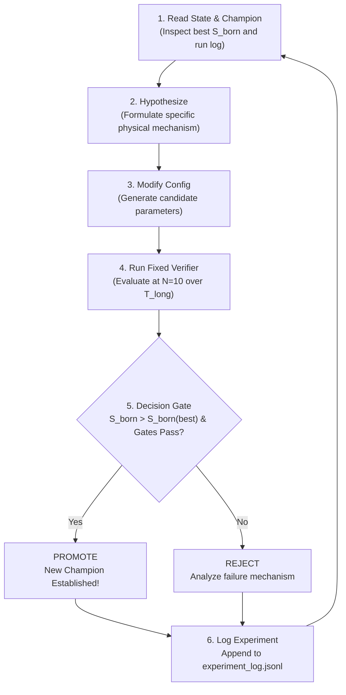

# goal_born_search.md — Autoresearch: Maximizing \(S_{\rm Born}\) at \(N = 10\)

> **Autonomous Research Goal:** Discover the Hamiltonian configuration within the space of models realizable via [`quspin_hamiltonians`](core/hamiltonians/quspin_hamiltonians.py) that maximizes the Born-similarity metric \(S_{\rm Born}\) at \(N = 10\).

---

## 1. Research Objective & Single Scalar Metric

The objective is to find a set of physical Hamiltonian parameters \(\boldsymbol{\theta}_{\rm config}\) that maximizes the canonical Born-similarity score:

$$
\boxed{
\max_{\boldsymbol{\theta}_{\rm config}} S_{\rm Born}(\boldsymbol{\theta}_{\rm config})
}
$$

evaluated at fixed system size **\(N = 10\)** over a fixed collection of long evolution times.

### The Objective Metric: \(S_{\rm Born}\)
The canonical Born similarity \(S_{\rm Born} \in [0, 1]\) is computed via [`core.born.born_ratio_from_theta`](core/born.py#L187-L240):

1. For a given configuration at \(N = 10\), compute the projective roots \(\theta_j^{(N)}(t)\) across a fixed ensemble of \(K\) long evolution times \(\mathcal{T}_{\rm long} = \{t_1, t_2, \dots, t_K\}\).
2. Accumulate the time-averaged polar distribution \(P_N(\theta)\) over 100 uniform bins in \([0, \pi]\):
   $$
   P_N(\theta) = \frac{1}{K} \sum_{k=1}^K P_N(\theta, t_k).
   $$
3. Construct the reflection ratio:
   $$
   R_N(\theta) = \frac{P_N(\theta)}{P_N(\theta) + P_N(\pi - \theta)}.
   $$
4. Compute the \(\sin\theta\)-weighted \(L_1\) similarity against the exact Born target \(R_{\rm Born}(\theta) = \cos^2(\theta/2)\):
   $$
   S_{\rm Born} = 1 - 2 \int_0^\pi \left| R_N(\theta) - \cos^2\frac{\theta}{2} \right| \sin\theta \, d\theta.
   $$

* **Target:** A perfect Born profile yields \(S_{\rm Born} = 1.0\).
* **Baseline Null:** An uninformative flat law \(R(\theta) \equiv 1/2\) scores \(S_{\rm Born} \approx 0.0\).
* **Current Best Benchmark:** \(S_{\rm Born} \approx 0.956\) (gapped / anisotropic ring controls).
* **Mandatory Perturbative Constraint:** The central qubit–detector coupling is **strictly perturbative** relative to the intrinsic detector scales:
  $$
  g \ll \Lambda_{\rm detector} \equiv \max(|J|, |J_{xx}|, |J_{yy}|, |J_{\pm}|, |J_2|, |h_x|, |h_z|).
  $$
  Configurations with non-perturbative couplings (\(\epsilon > 0.15\)) are physical non-starters and are disqualified by the evaluator.

---

## 2. Search Space: `SinglePixelHamiltonianQuSpin`

Every candidate configuration must be strictly realizable using the repository's production Hamiltonian builder [`SinglePixelHamiltonianQuSpin`](core/hamiltonians/quspin_hamiltonians.py):

| Parameter | Type | Allowed Domain | Physical Role |
|---|---|---|---|
| `N_pixel` | `int` | **10** (Fixed) | Detector system size |
| `connectivity` | `str` | `{"ring", "chain"}` | Periodic ring vs open endpoint chain |
| `central_coupling` | `str` | `{"auto", "all", "first"}` | Uniform collective (ring) or boundary (chain) |
| `J` | `float` | \([-5.0, 5.0]\) | Nearest-neighbor \(Z_i Z_{i+1}\) coupling |
| `Jxx` | `float` | \([-5.0, 5.0]\) | Nearest-neighbor \(X_i X_{i+1}\) coupling |
| `Jyy` | `float` | \([-5.0, 5.0]\) | Nearest-neighbor \(Y_i Y_{i+1}\) coupling |
| `Jpm` | `float` | \([-5.0, 5.0]\) | Spin-flip exchange \(\sigma_i^+ \sigma_{i+1}^- + \text{h.c.}\) |
| `J2` | `float` | \([-5.0, 5.0]\) | Next-nearest-neighbor \(Z_i Z_{i+2}\) coupling (frustration) |
| `Jpm2` | `float` | \([-5.0, 5.0]\) | NNN spin-flip exchange |
| `hx` | `float` | \([-5.0, 5.0]\) | Transverse detector field (\(X_i\)) |
| `hz` | `float` | \([-5.0, 5.0]\) | Longitudinal detector field (\(Z_i\)) |
| `hx0` | `float` | \([-5.0, 5.0]\) | Central-qubit transverse field (\(X_0\)) |
| `hz0` | `float` | \([-5.0, 5.0]\) | Central-qubit longitudinal field (\(Z_0\)) |
| `Jx` | `float` | \([-0.25, 0.25]\) | Central-qubit transverse coupling (\(X_0 X_i\)) — **Perturbative** |
| `Jy` | `float` | \([-0.25, 0.25]\) | Central-qubit transverse coupling (\(Y_0 Y_i\)) — **Perturbative** |
| `Jz` | `float` | \([-0.25, 0.25]\) | Central-qubit longitudinal coupling (\(Z_0 Z_i\)) — **Perturbative** |
| `Jzx` | `float` | \([-0.25, 0.25]\) | Cross-axis coupling (\(Z_0 X_i\)) — **Perturbative** |
| `Jcpm` | `float` | \([-0.25, 0.25]\) | Central-detector spin-flip exchange — **Perturbative** |

### Perturbative Validity Invariant
The control parameter is defined as:
$$
\epsilon \equiv \frac{\max(|J_x|, |J_y|, |J_z|, |J_{zx}|, |J_{c\pm}|)}{\max(|J|, |J_{xx}|, |J_{yy}|, |J_{\pm}|, |J_2|, |J_{\pm 2}|, |h_x|, |h_z|)}.
$$
The search space is strictly bounded by:
$$
\epsilon \le \eta_{\rm pert} = 0.15.
$$
Configurations with \(\epsilon > 0.15\) or vanishing intrinsic detector scales (\(\Lambda_{\rm detector} = 0\)) are disqualified.

All disorder parameters (`disorder_strength*`) are set to **0.0** (clean configurations) unless explicitly exploring disorder-induced localization.

---

## 3. Fixed Verifier & Evaluator Boundary

The evaluator is Karpathy's immutable `eval.py`. **Never modify the evaluator to artificially inflate \(S_{\rm Born}\).**

### Evaluator Protocol (`eval_born.py`)
1. **Instantiation:**
   Build the model via `SinglePixelHamiltonianQuSpin(N_pixel=10, **candidate_config)`.
2. **Eigendecomposition:**
   Diagonalize \(H = V \Lambda V^\dagger\) once using LAPACK divide-and-conquer (`scipy.linalg.eigh(driver="evd")`) or sector blocks.
3. **Fixed Long-Time Grid \(\mathcal{T}_{\rm long}\):**
   Evaluate across \(K = 6\) logarithmically spaced times in the asymptotic dephasing window (enforcing sub-10-second verification per candidate):
   $$
   t_k \in [100.0, 1000.0], \qquad k = 1, \dots, 6.
   $$
4. **Projective-Root Extraction:**
   For each time \(t_k\), compute \(U_{00}(t_k), U_{10}(t_k)\) from the eigenbasis, and extract projective roots via [`generalized_relative_evolution_spectrum`](core/relative_evolution_pencil.py).
5. **Quality & Physical Validity Gates:**
   - **Perturbative Coupling Validity:** \(\epsilon = \frac{g_{\rm max}}{\Lambda_{\rm detector}} \le 0.150\) (reject non-perturbative coupling).
   - **Hermiticity:** \(\|H - H^\dagger\| / \max(\|H\|, 1) \le 10^{-12}\).
   - **Column Isometry:** \(\|U_{00}^\dagger U_{00} + U_{10}^\dagger U_{10} - I\| \le 10^{-10}\).
   - **Regularity:** No indeterminate / NaN generalized eigenvalues.
   - **Angular Coverage:** Minimum 20 occupied bins in \(P(\theta)\) (reject trivial single-atom delta spikes).
6. **Output:**
   Return scalar \(S_{\rm Born}\), mean absolute ratio error, angular bin coverage, and perturbative ratio \(\epsilon\).

---

## 4. The Karpathy Autoresearch Loop

Iterate relentlessly through the following loop:



### Step 1: Read State
- Read current champion configuration from `reports/born_optimization/champion.json`.
- Read recent negative outcomes from `reports/born_optimization/experiment_log.jsonl`.

### Step 2: Hypothesize
Propose **one** physical intervention per iteration:
- *Hypothesis examples:*
  - "Introducing nonzero \(J_{xx} - J_{yy}\) will break azimuthal degeneracy and smooth the polar distribution."
  - "Tuning \(h_z \approx h_{z0}\) into the avoided-crossing resonance will enhance non-diagonal transition amplitudes."
  - "Frustrating the ring with antiferromagnetic \(J_2 > 0\) will suppress boundary pinning and improve \(S_{\rm Born}\)."

### Step 3: Modify Config
Write candidate parameters into `candidate.json`.

### Step 4: Run Fixed Verifier
Execute the fixed evaluation script:
```bash
$PYTHON scripts/eval_born.py --candidate candidate.json --log reports/born_optimization/experiment_log.jsonl
```

### Step 5: Decide
- **`PROMOTE`**: If \(S_{\rm Born} > S_{\rm Born}^{\rm best}\) and all quality gates pass, overwrite `reports/born_optimization/champion.json` with the new configuration.
- **`REJECT`**: If \(S_{\rm Born} \le S_{\rm Born}^{\rm best}\), discard the candidate. Do not tune evaluation thresholds to rescue it.

### Step 6: Log
Append a machine-readable JSON record containing:
- `timestamp`, `commit`, `config_params`, `S_born`, `mean_abs_error`, `coverage`, `status` (`PROMOTE` / `REJECT`), `rationale`.

---

## 5. Experiment Record Schema (`experiment_log.jsonl`)

Each run appends exactly one line:

```json
{
  "run_id": "run_0042",
  "timestamp": "2026-09-14T00:15:00Z",
  "N": 10,
  "config": {
    "connectivity": "ring",
    "J": 1.0,
    "Jxx": 0.35,
    "Jyy": 0.15,
    "J2": 0.2,
    "hx": 0.1,
    "hz": 0.45,
    "hx0": 0.05,
    "hz0": 0.45,
    "Jx": 0.08,
    "Jy": 0.0,
    "Jz": 0.08
  },
  "metrics": {
    "S_born": 0.961204,
    "mean_abs_ratio_error": 0.03879,
    "coverage_bins": 84,
    "max_isometry_residual": 1.2e-14
  },
  "decision": "PROMOTE",
  "hypothesis": "Resonant longitudinal fields hz=hz0=0.45 with mild XXZ anisotropy Jxx=0.35."
}
```

---

## 6. Immutable Invariants & Verification Rules

1. **Evaluator Immutability:** Never alter the time ensemble \(\mathcal{T}_{\rm long}\), bin count (100 bins), or similarity metric in `core.born` during a search campaign.
2. **Strict System Size:** Every candidate is judged at **\(N = 10\)**. Do not judge candidates at \(N = 4\) and assume scaling holds.
3. **Strict Perturbative Coupling Invariant:** The central qubit–detector coupling must satisfy \(\epsilon \le 0.150\). Solutions attempting to produce Born statistics by driving the system into a non-perturbative or hybridized regime (\(g \sim \Lambda_{\rm detector}\)) violate the foundational physical model and are automatically rejected.
4. **No Metric Substitution:** Do not replace \(S_{\rm Born}\) with variance, entanglement entropy, or surrogates. The goal is explicitly maximizing \(S_{\rm Born}\).
5. **Negative Results are Progress:** Failed hypotheses eliminate unpromising regions of parameter space. Always record rejected runs to prevent looping.
6. **Continuous Operation:** Run autonomously until \(S_{\rm Born} \ge 0.99\) or a fundamental physical saturation bound is identified.
