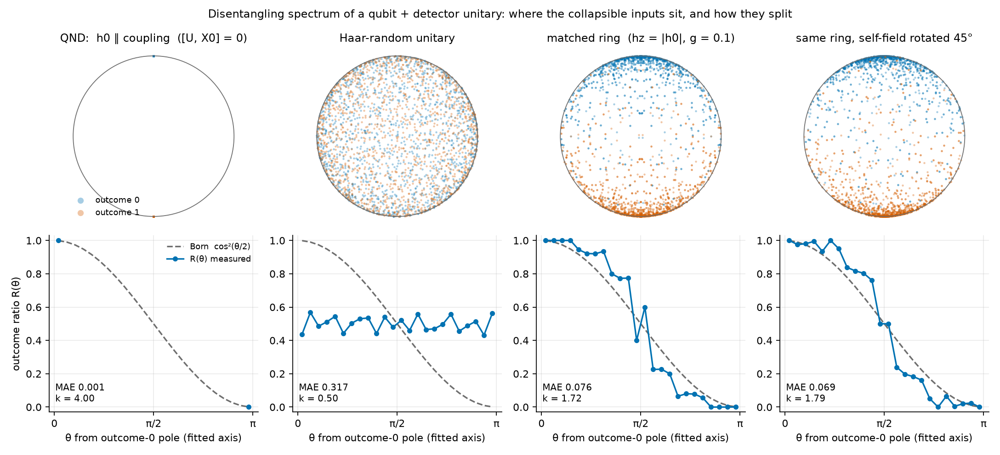

# Where do collapsible states live? — a starting kit

*Kaminer group, September 2026. Everything here is either proven, reproduced numerically at least twice, or explicitly labelled a conjecture.*

## 0. The hook

Take **any** unitary U on a qubit ⊗ a large system of dimension d. Ask an elementary question: which product inputs ψ⊗D does U send to a product output with the qubit in a *definite* state — say |0⟩? Writing U in the qubit basis as four d×d blocks, the answer is a d×d matrix pencil, (U₁₀ + λU₁₁)D = 0, so there are exactly d such inputs per outcome, labelled by the qubit ray λ, i.e. by d points on the Bloch sphere. Call this the *disentangling spectrum* of U.

Three facts about it, each provable in an afternoon:

- The outcome-0 and outcome-1 point clouds are **exact antipodes of each other, for every U.**
- For a **Haar-random** U the clouds are **uniform** on the sphere: the ratio of outcome-0 to outcome-1 points at any input direction is ½. A perfectly random apparatus measures nothing.
- For a U that **conserves energy** (commutes with H_qubit + H_detector, qubit gapped), every point sits at a **pole** when read along the energy axis: a superposition is never collapsed. Energy conservation forbids exact collapse in the energy basis. Read along an orthogonal axis, the same U gives a cloud confined to a single great circle (T5 below).

Between "knows nothing" and "collapses nothing" is where measurement would have to live: clouds concentrated toward the poles but covering the sphere, with the outcome ratio R(θ) at polar angle θ from the outcome-0 pole equal to the Born weight cos²(θ/2). A particular many-body model — a qubit resonantly exchanging its quantum with a spin ring — gets strikingly close (figure below, third and fourth panels), and the axis of its cloud is set by the qubit's own energy direction, not by the coupling. The question this project is about: **what property of U puts the disentangling spectrum on the Born curve, and is any many-body system actually there?** It is a question in many-body physics regardless of what one believes about measurement.



## 1. The object, precisely

U on ℂ²⊗ℂ^d, blocks U_ba (qubit a in, b out). Input qubit ray |0⟩+λ|1⟩, homogeneous coordinates [α:β], λ = β/α, so λ = ∞ is allowed.

- Outcome 0: (U₁₀ + λU₁₁)D = 0. Outcome 1: (U₀₀ + λU₀₁)D = 0. Weight of a root = kernel dimension (matters only for degenerate pencils).
- Bloch vector of the input ray: r = (2Re λ̄, 2Im λ̄, 1−|λ|²)/(1+|λ|²) (with the convention in `playground.py`).
- Outcome-conditioned measures ρ₀, ρ₁ on S²; weak criterion R(θ) = ρ₀/(ρ₀+ρ₁) after azimuthal integration; strong criterion is the same pointwise on S² with a unique axis. Born ⇔ R = cos²(θ/2).
- Equivalent characterization you will use: with A_ψ = (⟨1|⊗I)U(|ψ⟩⊗I) the *wrong-branch operator* and ℓ(ψ) = (1/d)·log det(A_ψ†A_ψ), the root density is ρ₀ = (d/4π)(1 + Δ_{S²}ℓ) (Gauss's law: roots are charges, ℓ their potential). Born with flat envelope ⇔ ℓ = const − r_z/2.

The group's frozen definitions are `SPEC.md` §3–6 in the repository; the production code solves the *fixed-input* pencil U₁₀v = zU₀₀v, which is the outcome-0 pencil of U† and coincides with it up to conjugation whenever H is real (`wiki/concepts/fixed-input-outcome-equivalence.md`, proved 2026-09-21).

## 2. Three theorems to prove this week

**T1 (antipodality).** The outcome-1 roots are {−1/λ̄ : λ an outcome-0 root}, with equal kernel dimensions. *Hint:* unitarity gives U₀₀†U₀₁ + U₁₀†U₁₁ = 0; take adjoints of the outcome-1 pencil. Consequence: Born is a property of **one** cloud — ρ₀(ψ)/ρ₀(ψ⊥) = |⟨0|ψ⟩|²/|⟨1|ψ⟩|².

**T2 (Haar ⇒ uniform).** For U Haar on U(2d) the one-point density of the roots is uniform on S² and R ≡ ½. *Hint:* qubit-basis rotations act on U by conjugation with V⊗I and on λ by Möbius maps; Haar is invariant. (The full point process is the complex spherical ensemble; see Krishnapur and Alishahi–Zamani in the repo's literature map.) Consequence: heavy tails and randomness are the *null*, not the mechanism.

**T3 (secular no-go).** Let H₀ = −h₀ n̂·σ + H_D with h₀ ≠ 0, and let W be any unitary with [W, H₀] = 0. Then every outcome-(±n̂) root of W is at the ±n̂ pole with multiplicity d. *Hint:* in a basis ordered by detector energy, W₋₊ lowers E_D by exactly 2h₀ and W₋₋ preserves it, so W₋₊ + λW₋₋ is block-triangular and det = λ^d·∏det W₋₋^(E). Consequence: any spread of the cloud is an **off-shell** effect — produced by the part of the dynamics that does *not* conserve the bare energy — riding on resonant exchange.

Bonus **T4**: derive the Gauss-law identity of §1 from log det(A_ψ†A_ψ) = Σ_j log|⟨ψ|·⟩…| (the wrong-branch determinant vanishes exactly at the roots). Then check T1–T4 numerically with `playground.py` before believing your proofs.

**T5 (echo reduction).** If [U, X₀] = 0, write U = P₊⊗U₊ + P₋⊗U₋ with P± the X₀ projectors. Then the z-basis production roots are λ = i·tan(φ/2), where e^{iφ} runs over the eigenvalues of the detector-only echo operator W = U₋†U₊; hence θ = |φ| and the whole cloud lies on the y–z meridian. *Hint:* U₁₀ = (U₊−U₋)/2 and U₀₀ = (U₊+U₋)/2. Consequence: for the repository's zero-field, X-only rings (§4, Family Q) the entire polar histogram is the folded eigenphase density of a Loschmidt echo of the detector alone, and Born there means that density is the cardioid (1+cos θ)·(reflection-even), i.e. its Fourier moments d_m = 2a_{2m+1} − a_{2m} − a_{2m+2} vanish. Checked to 10⁻¹⁴ at N = 8 on the repository's N = 17 ring parameters.

## 3. See it (ten minutes)

```
python playground.py anchors --N 8 --K 8 --fig anchors.png   # the figure above; QND / Haar / matched ring / rotated self-field
python playground.py rotate                                  # the cloud's axis follows the self-field direction, not the coupling axis
python playground.py detune                                  # break the resonance 2|h0| = 2hz by 10%: everything pins to the poles
python playground.py gscan                                   # steepness k of R(θ) vs coupling: passes THROUGH Born (k=1), does not stop there
python playground.py ladder                                  # no spins at all: random matrices on an energy ladder show the same phenomenon
python playground.py time                                    # a single long time is one noisy draw of the "dephased" ensemble
```
`k` is the fitted exponent of R = c^{2k}/(c^{2k}+s^{2k}), c = cos(θ/2): k = 1 is Born, k → ∞ is "collapse to the nearer pole", k → 0 is R ≡ ½. Reference numbers at 4096 roots: an exactly Born cloud gives MAE 0.013 ± 0.004 against cos²; the Haar null gives 0.32.

## 4. State of knowledge

**Established (proved, or reproduced independently by ≥ 2 implementations):**
- T1–T5 above; the fixed-input/outcome-pencil equivalence for real H.
- The repository's positive results come in **two families that must not be conflated.** *Family Q (zero qubit field, one conserved qubit axis):* every September-2026 lead has h₀ = 0 and an X-only collective coupling, so X₀ is conserved and T5 applies. These are meridional clouds whose polar histograms are the best Born fits in the project (XXZ rings, 64-bin ratio RMSE 0.051 → 0.016 for N = 14 → 17; config 353: 0.008). They satisfy only the weak criterion, by geometry; any qubit field breaks them at once (h_z0/h_z = 10⁻⁴ already triples the N = 17 error), and Theorems C and H in `research_reports/` exclude an open Born phase in their commuting versions. *Family F (matched field, full sphere):* the manuscript ring with h_z0 = h_z = 0.1, J = 1, J_x = 0.01, the only family that passes the July coverage and azimuthal-isotropy gates; polar score 0.19 → 0.81 for N = 11 → 16 (single times), 0.36/0.54/0.65 at N = 9/10/11 in the dephased ensemble, with k = 1.1–1.5. The figure above and everything below refer to Family F unless stated. Neither family is credited under `SPEC.md` v1.0.
- In U = e^{−iHT}, T→∞ is the *dephased* ensemble (one random phase per energy level); the cloud is a functional of H's **eigenvectors** alone.
- Axis selection: for coupling g ≪ gap the cloud is axisymmetric about the qubit's energy direction ĥ₀ (within 1–2° for all tilts up to 89.5°); for g ≳ gap it rotates toward the coupling eigenbasis. This is Paz & Zurek (PRL 82, 5181, 1999) / Zurek (PRD 24, 1516, 1981) in exact-root form.
- Existence threshold: full-sphere clouds require detector transitions resonant with the qubit gap within ≈ g, driven by a coupling with a non-commuting (non-QND) component; otherwise T3 applies approximately and the roots pin. In Family F the window in h_z0 is about ± collective J_x: a 10 % detuning pins 93 % of the roots at N = 8 and 10, and h_z0 = 0 turns the model into a pinned member of Family Q. Zero qubit field with two strong non-commuting couplings also gives a full-sphere cloud, with the axis set by the dominant coupling instead of the field and k ≈ 1.5–1.9. Verified on the Ising ring, on a disordered non-interacting spin bath, and on the random-matrix ladder. Level statistics of the detector (Wigner–Dyson vs Poisson) are irrelevant: the working detector is a *classical* Ising ring.
- Shape: the ratio is systematically **steeper than Born** at weak coupling (k ≈ 1.5 for N = 7…12, N-independent), crosses k = 1 at an intermediate coupling that depends on detector structure, and flattens toward ½ beyond. In the ladder model k also falls with the number of ladder rungs M (M = 2: step; M = 8: ≈ Born; M = 16: flat). Born is a codimension-one surface in parameter space at every size studied.
- Ratio-of-amplitudes viewpoint: λ is a ratio of a wrong-branch to a right-branch amplitude. Jointly Gaussian amplitudes give Möbius images of the uniform sphere (Poisson-kernel clouds); the outcome ratio of that family passes within 0.059 of Born at variance ratio s ≈ ½ and is never exactly Born.
- Basin volumes: weighting roots by the volume of ε-approximate collapse around them spans e^{2000} at N = 8, concentrated on the pole roots. Off-pole collapsible states are exponentially fine-tuned.

**Conjectured:**
- *Weak:* for a small system whose exchange with the detector is exactly graded (energy- or axis-conserving) and resonant, generically dressed by a non-commuting coupling, the dephased disentangling spectrum lies in a universal one-parameter family (steepness), Born being one interior point.
- *Strong:* as d → ∞ at fixed local bandwidth the steepness flows to k = 1 for a range of couplings (Born as a fixed point). No evidence for this at d ≤ 2048 or N ≤ 12; it is the claim the project needs. For Family Q the same question is whether the interacting detector's echo spectrum tends to the cardioid; the N = 14–17 data say yes so far, and no theorem supports it.

**Dead (do not spend time on these as *the* mechanism):** Wigner–Dyson statistics of the detector; Markovianity of the reduced dynamics (neither necessary nor sufficient at N ≤ 9); "a free choice of measurement axis" (the axis is predicted, not free); generic Jordan-chain amplification of the dressing (refuted — the *structure* of the dressing matters, not its size).

## 5. Your first project

**Part A — provable now (1–2 weeks). The Gaussian-amplitude theorem.** Let the wrong- and right-branch amplitudes (a, b) be jointly complex Gaussian (any covariance). Show that the cloud of λ = a/b is the image of the uniform measure on S² under a Möbius map, compute its outcome ratio in closed form (for independent a ~ CN(0,s²), b ~ CN(0,1): R_s(θ) = (s²sin²+cos²)²/[(s²sin²+cos²)² + (s²cos²+sin²)²], half-angles), and prove that cos²(θ/2) is not in the family (compare harmonic content: Born is pure ℓ ≤ 1). Corollary: **no Gaussian-amplitude model of a detector can give exact Born.** This is a theorem the group does not yet have written down, and it explains why every "Born-like" result so far stops at "-like".

**Part B — open, and reachable.** Which non-Gaussian joint law of (a, b) gives exactly Born? In log-radius x = ln|λ| the requirement is a unit exponential tilt: q(x) = e^{−x}·(even), against sech²(x − ln s) for Gaussians. Find the minimal such law, then fit the Möbius family to the exact ring and ladder clouds and study the *residual* as a function of N, g and M. If the residual vanishes as N grows, the mechanism is Gaussian and Born will never be exact in these models; if it grows toward the tilt, something non-Gaussian is emerging and that is the object to understand.

**Part C — Family Q as a spectral problem.** By T5 the zero-field rings reduce to the eigenphase law of W = e^{it(H_D+gS)}·e^{−it(H_D−gS)}, S = ΣX_i. At weak coupling the eigenphases are ≈ 2g times the eigenvalues of the dephased Schrieffer–Wolff generator K = Σ_{a≠b} S_ab/(E_a−E_b)·e^{iφ_ab}|a⟩⟨b|. Derive the eigenvalue density of K for an XXZ ring, or for a random-matrix model of it, and ask when it is the cardioid. This is a random-matrix question with no measurement content in it, and it is where the repository's best numbers live.

**Alternatives, if you prefer:**
- *Random-matrix route.* The ladder model (`playground.py ladder`) is a five-parameter problem with no spin structure: gap, band width w, rungs M, coupling g, dimension d. Derive k(M, g, w, d) — even the M-dependence at w = 0 would be new — and identify the single effective parameter the data suggest.
- *Analytic route.* In the dephased limit U = V·W·V† with W energy-conserving (block-Haar on resonant shells is a good surrogate) and V = e^{−iS} the first-order Schrieffer–Wolff rotation. T3 says W alone gives poles; compute the root law of V·W·V† to leading nontrivial order in S. Warning from the referees: it depends on the structure of S, not on ‖S‖.
- *Large-N route (needs the Zeus cluster).* k(N) for the matched ring at N = 14–18 and fixed g. A plateau at ≈ 1.5 kills the strong conjecture; a drift to 1 for a range of g establishes it.

## 6. Reading, in this order

1. This file, then `playground.py` end to end (it is 200 lines).
2. Matan's figure `ising_ring_h0_rotation_N12_t1e06_sectors_h0basis.pdf` and the analysis of it, `self_field_rotation_analysis.md` (all numbers behind §4).
3. Repository `AdQuanta/collapse`: `SPEC.md` (definitions and the hard-fail rules), `wiki/concepts/projective-roots.md`, `outcome-antipodality.md`, `born-like-points.md`, `fixed-input-outcome-equivalence.md`, `research_reports/BORN_STRUCTURE_ANALYSIS.md` (the Poisson-kernel phase law and the (1+cosθ)·even characterization), `research_reports/BORN_WEAK_COUPLING_SEARCH.md` (the Family Q leads and their h_z0 scan), `BORN_LIKE_CONSTRUCTIVE_FAMILY.md` (the designed cardioid family) and `BORN_DETUNING_INTERVAL.md` (Theorems H and H1). Skip `RESEARCH_STATE.md`, `goal.md`, `goal_born_search.md` at first — partly stale.
4. The manuscript draft *Measurement-Like Behavior from Unitary Many-Body Dynamics* (Sept 2026) for the framing; read it after §1–5 so you can see what it claims and what it does not.
5. Literature: Zurek PRD 24, 1516 (1981) and Paz–Zurek PRL 82, 5181 (1999) for the two pointer-basis limits; Cucchietti–Paz–Zurek PRA 72, 052113 (2005) for the central-spin analogue; Schulman, *Entropy* 14, 665 (2012) and *Entropy* 19, 343 (2017) for special states (check his Lorentzian argument against T2 — a Cauchy of vanishing width in λ gives k = 2, not Born); Debbasch, EPTCS 315, 100 (2020) for Born from optional stopping (assumes both the basis and zero drift); Krishnapur (2009) / Alishahi–Zamani for the spherical ensemble. Take exact citations from `wiki/concepts/literature-map.md`.

## 7. Working rules that have already saved this project from wrong conclusions

- Root counts grow as 2^N; any "improvement with N" must survive thinning to a fixed root budget (`SPEC.md` hard-fail 6).
- Report MAE against the Born sampling floor at the same root count, and report the steepness k; "24/24 coverage and Born-looking" is achieved by clouds that are not Born (k = 1.3–1.5) and even by pole-pinned clouds.
- A single long time is a favourable or unfavourable draw; use the dephased ensemble or a pooled time window, and say which.
- The weak (azimuth-integrated) ratio hides the even envelope; report the axis, the azimuthal moments, and the pole fraction with every ratio.
- Definitions, thresholds and bins are frozen in `SPEC.md`; changing them after seeing results is forbidden, as is adding a Hamiltonian family without approval.

## 8. Files in this pack

`README_STUDENT.md` (this), `playground.py` (self-contained: numpy, scipy, matplotlib), `fig_three_anchors.png`, Matan's N = 12 figure `ising_ring_h0_rotation_N12_t1e06_sectors_h0basis.pdf` (sent separately, not in the repository), `self_field_rotation_analysis.md` (its independent analysis and the parameter scans).
