# Exact collapse formalism: evidence and theta plots

> Sources: Repository derivation and execution, 2026-09-19; User instruction, 2026-09-19
> Raw: [Exact formalism validation](../../raw/campaigns/2026-09-19-exact-formalism-validation.md); [Exact-formalism gate activation approval](../../raw/project-governance/2026-09-19-exact-formalism-gate-activation-approval.md)
> Updated: 2026-09-19

## Current status

The exact-collapse formalism gate is **COMPLETE**; see the [paper readiness ledger](../governance/paper-readiness-ledger.md) for the full promotion record. The activated verifier (`exact-formalism-v1`) independently reruns to **PASS**, with 88 valid states accepted and 34 expected rejections correctly rejected. The focused suite passes 26 tests. The full suite has 641 passes and 2 failures; both are pre-existing (reproduce identically against the unmodified root module) and concern numerical root-matching under symmetry-driven eigenvalue clustering, not the state-level identity certified here. They remain open and block the "Complete matrix-pencil characterization," "No unresolved hard failure," and "Executable verifier" gates. No other gate receives credit from this work. `paper_ready=false`.

The [proof and verifier contract](../../verifier/exact_formalism/v1/METHOD.md)
establish the exact state-level equivalence for either outcome, including pole
coordinates, degenerate kernels and singular pencils. Maximum positive-state
forbidden-branch norm: 5.291901841267055e-16. This is a reconstruction diagnostic,
not a high-fidelity replacement for the exact kernel equation.

## Reading the plots

Each figure contains the two separately normalized theta histograms and their
ratio against the Born reference cos(theta/2)^2. All figures use 18 fixed bins;
empty bins are undefined and no pseudocounts are added. Generic outcome sets
were solved independently and checked for antipodal pairing. Small deterministic
fixtures do not establish any Born-statistics or estimator-robustness gate.

The analytically known regular fixtures use supplied kernel weights. SWAP has
no defined continuum measure: its figure shows six representative rays per
outcome only. Selected kernel superpositions are also incomplete samples.
Negative panels visualize rejected inputs, not physical outcome measures.
Inputs with invalid dimensions or zero rays have no defined theta histogram;
the API rejects them in tests.

### Identity: pole outcomes

Analytic pole measure (kernel weights).

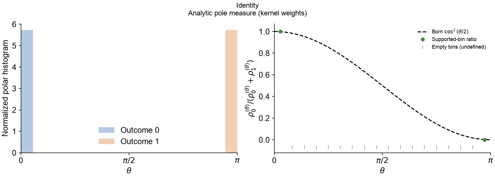

[Vector PDF](../../reports/exact_formalism/2026-09-19-candidate-v1-review/plots/identity.pdf)

### QND: pole outcomes with detector evolution

Analytic pole measure (kernel weights).

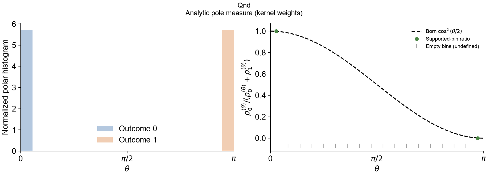

[Vector PDF](../../reports/exact_formalism/2026-09-19-candidate-v1-review/plots/qnd.pdf)

### Generic unitary: independently solved outcomes

Regular simple-root fixture; both pencils solved.

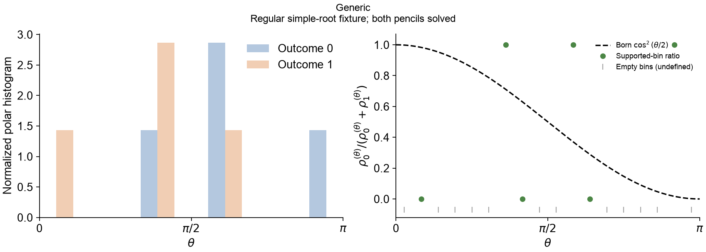

[Vector PDF](../../reports/exact_formalism/2026-09-19-candidate-v1-review/plots/generic.pdf)

### Repeated semisimple root: kernel weights

Analytic semisimple measure (kernel weights).

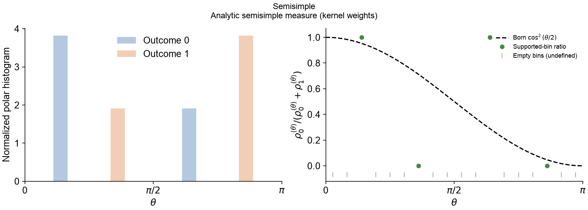

[Vector PDF](../../reports/exact_formalism/2026-09-19-candidate-v1-review/plots/semisimple.pdf)

### Selected kernel superpositions: incomplete sample

Selected kernel superpositions; incomplete ray sample.

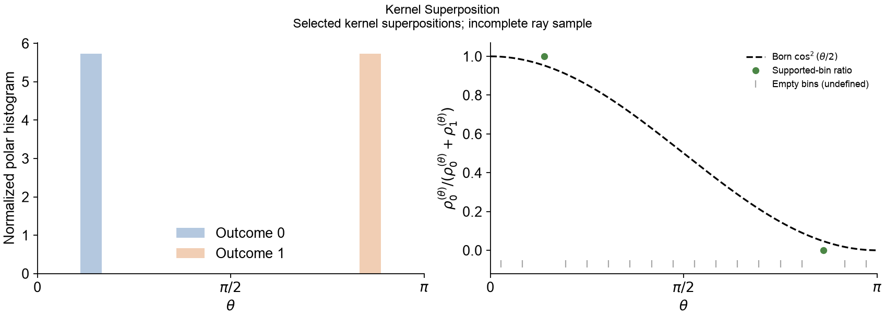

[Vector PDF](../../reports/exact_formalism/2026-09-19-candidate-v1-review/plots/kernel_superposition.pdf)

### Defective root: one kernel vector rather than two algebraic copies

Analytic defective measure; kernel weight one.

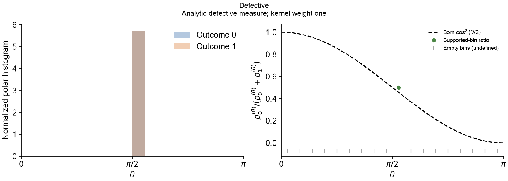

[Vector PDF](../../reports/exact_formalism/2026-09-19-candidate-v1-review/plots/defective.pdf)

### SWAP: illustrative sample, continuum measure undefined

Illustrative rays only; continuum measure UNDEFINED.

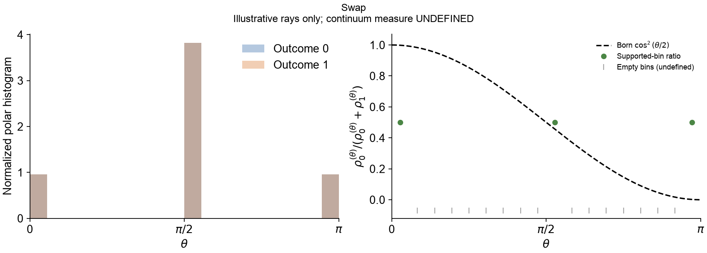

[Vector PDF](../../reports/exact_formalism/2026-09-19-candidate-v1-review/plots/swap.pdf)

### Homogeneous coordinate rescaling

Same generic roots after homogeneous rescaling.

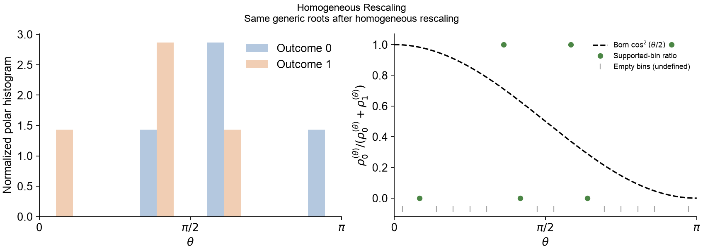

[Vector PDF](../../reports/exact_formalism/2026-09-19-candidate-v1-review/plots/homogeneous_rescaling.pdf)

### Detector basis permutation

Same generic roots after detector basis permutation.

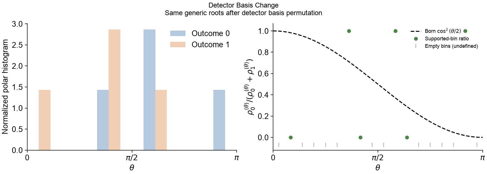

[Vector PDF](../../reports/exact_formalism/2026-09-19-candidate-v1-review/plots/detector_basis_change.pdf)

### Uncoupled spectator: unchanged normalized root measure

Generic roots with threefold spectator kernel weights.

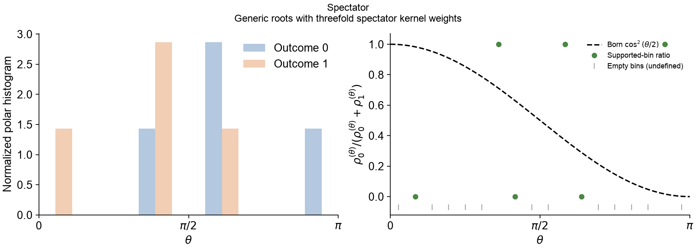

[Vector PDF](../../reports/exact_formalism/2026-09-19-candidate-v1-review/plots/spectator.pdf)

### Negative control: wrong outcome

REJECTED inputs; not collapsible outcome sets.

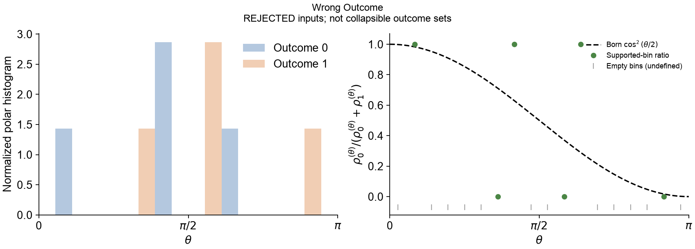

[Vector PDF](../../reports/exact_formalism/2026-09-19-candidate-v1-review/plots/wrong_outcome.pdf)

### Negative control: swapped coordinates

REJECTED inputs; not collapsible outcome sets.

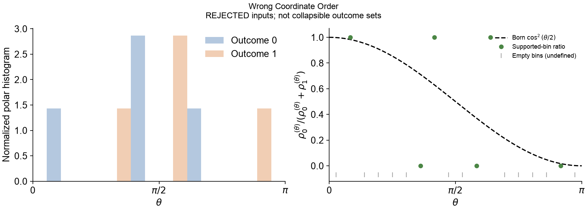

[Vector PDF](../../reports/exact_formalism/2026-09-19-candidate-v1-review/plots/wrong_coordinate_order.pdf)

### Negative control: perturbed detector

REJECTED detector states; input-ray sample only.

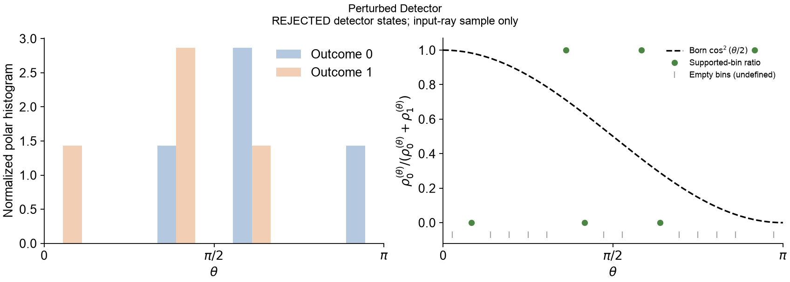

[Vector PDF](../../reports/exact_formalism/2026-09-19-candidate-v1-review/plots/perturbed_detector.pdf)

### Negative control: nonunitary operator

REJECTED nonunitary operator; input-ray sample only.

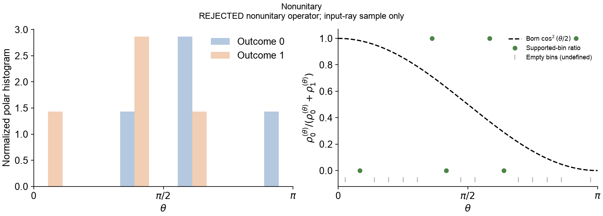

[Vector PDF](../../reports/exact_formalism/2026-09-19-candidate-v1-review/plots/nonunitary.pdf)

### Negative control: near-collapse with high fidelity

REJECTED near-collapse inputs; high fidelity is insufficient.

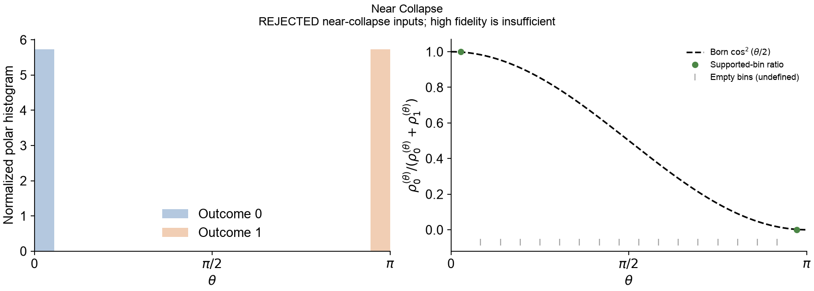

[Vector PDF](../../reports/exact_formalism/2026-09-19-candidate-v1-review/plots/near_collapse.pdf)

## Evidence and unresolved work

- [Validation report and reproduction commands](../../research_reports/EXACT_FORMALISM_VALIDATION_2026-09-19.md)
- [Draft verification result](../../reports/exact_formalism/2026-09-19-candidate-v1-review/review_result.json)
- [Histogram data](../../reports/exact_formalism/2026-09-19-candidate-v1-review/plot_data.json)
- [Full regression log](../../reports/exact_formalism/2026-09-19-candidate-v1-review/pytest-full.txt)
- [Unchanged-code reproduction of both failures](../../reports/exact_formalism/2026-09-19-candidate-v1-review/pytest-baseline-failures.txt)

No complete root enumeration, general multiplicity detection or singular measure
has been certified. The matched-ring and independent-spin numerical failures
remain open. The next action is review and explicit activation approval of the
concrete verifier, followed by fresh certification and independent review.

## See Also

- [Paper readiness ledger](../governance/paper-readiness-ledger.md)
- [Projective roots](../concepts/projective-roots.md)
- [Research control center](../governance/research-control-center.md)
