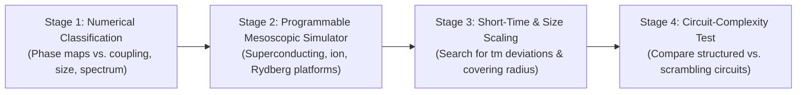

# Falsifiability, Experimental Routes, and Quantum Computing

## Overview
A core strength of the `unitary-collapse` program is that it does not merely offer an interpretational re-description; it exposes the restricted-state hypothesis to concrete experimental and numerical falsification. If the physically realized states are determined by finite-time unitary disentanglement conditions, measurement statistics are **emergent dynamical phenomena** that should exhibit measurable deviations in mesoscopic, short-time, or highly scrambled regimes.

---

## Four Concrete Falsification Routes (Draft §12)

### 1. Non-Born Mesoscopic Detectors (§12.1)
- **Prediction:** Carefully engineered detector Hamiltonians outside the Born-producing structural class (e.g., highly chaotic or Haar-scrambling environments) should produce systematic non-Born outcome weights.
- **Experimental Test:** Implement two different detector architectures on the same quantum hardware platform (superconducting qubits, trapped ions, or neutral-atom arrays) calibrated to have identical conventional decoherence rates. Standard quantum mechanics predicts standard Born probabilities for both; the restricted-state hypothesis predicts architecture-dependent non-Born outcome distributions.

### 2. Short-Time Readout Deviations (§12.2)
- **Prediction:** The special-state distribution approaches the stable Born profile only after a characteristic evolution timescale $t_m$ associated with many-body dephasing and information spreading.
- **Experimental Test:** Reading out the qubit at early times ($t \ll t_m$) should reveal systematic deviations from $\cos^2(\theta/2)$ before the asymptotic detector record structure stabilizes. This converts the operational measurement time $t_m$ into a directly falsifiable timescale.

### 3. Finite-Size Scaling of the Covering Radius (§12.3, §4.1)
- **Prediction:** For an $n$-qubit detector, the special-state set has finite cardinality $d = 2^n$ and is strictly measure zero on the continuous Bloch sphere. The point cloud approximates the continuous sphere only as $d \to \infty$.
- **Metric:** The covering radius $\delta_n$—the largest geodesic distance from any Bloch point to the nearest collapsible state. For a roughly uniform point process, $\delta_n \sim \sqrt{\log d / d} \sim \sqrt{n} 2^{-n/2}$.
- **Experimental Test:** Measure the scaling of the maximum Born-profile discrepancy as a function of detector size on a programmable processor incremented one qubit at a time.

### 4. Spectral-Transition / Scrambling Test (§12.4)
- **Prediction:** If a detector is tuned from a structured regime toward a fully scrambling regime (e.g., via an integrability-breaking transverse field), the outcome distribution is predicted to cross over from a Born dipole toward an isotropic Haar-like distribution.
- **Falsifiability:** Standard quantum measurement predictions are insensitive to detector Hamiltonians provided decoherence occurs. Observing or failing to observe this crossover directly tests the dynamical foundation.

---

## Quantum-Computing Implications & Metric Entropy (Draft §13)

Palmer’s *Rational Quantum Mechanics* (2026) suggests that finite arithmetic discretization imposes an absolute information-capacity ceiling on quantum computation. In `unitary-collapse`, the restriction is dynamical and Hamiltonian-dependent rather than arithmetic.

### Covering Complexity / Metric Entropy
Define the metric entropy of the physically realized state set $\mathcal{R}_N$ at precision $\varepsilon$:
$$
K_N(\varepsilon) = \log_2 \mathcal{N}_\varepsilon(\mathcal{R}_N),
$$
where $\mathcal{N}_\varepsilon$ is the minimum number of $\varepsilon$-balls in Hilbert-space norm needed to cover $\mathcal{R}_N$.

- **Hypothesis:** If $K_N(\varepsilon)$ grows only polynomially with qubit number $N$, while the generic Hilbert space dimension grows as $2^N$, highly delocalized quantum algorithms (e.g., deep random circuits, QFT, maximal scramblers) would encounter an architecture-dependent fidelity ceiling that cannot be explained by standard local error models.
- **Circuit Test:** Compare quantum circuits of matched depth and physical gate fidelity:
  - (a) Local structured circuits (low entanglement spreading).
  - (b) Approximate unitary designs / scrambling circuits.
  A systematic, reproducible deviation in (b) that correlates with the special-state capacity would provide evidence for a physical state restriction.

---

## Four-Stage Experimental Roadmap (Draft App. G)

1. **Stage 1 (Numerical Classification):** Map the boundaries of Born vs. non-Born behavior across coupling parameters, detector graphs, and energy spectra using exact diagonalization and HPC campaigns.
2. **Stage 2 (Programmable Mesoscopic Simulator):** Realize the target qubit-detector Hamiltonians on analog/digital quantum processors to test point-cloud predictions without treating the hardware as a universal quantum computer.
3. **Stage 3 (Short-Time and Size Scaling):** Experimentally probe early-time dynamics and systematic finite-$N$ deviations.
4. **Stage 4 (Circuit Complexity):** Benchmark deep quantum circuits against metric-entropy capacity bounds.

See also: [[big-picture]], [[born-like-points]], [[haar-baseline]], [[foundational-draft-aug2026]].
