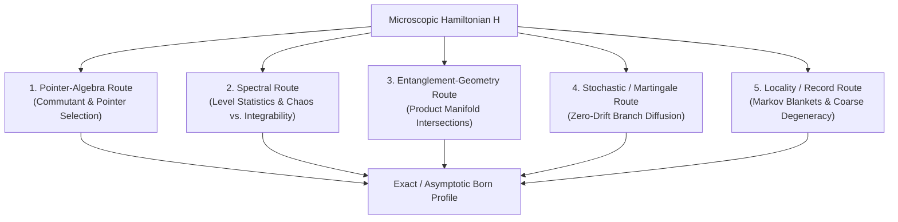

# Theorem Targets & Analytical Routes

## Overview
Section 15 of the foundational draft (`main.pdf`) establishes that resolving the emergence of Born statistics from unitary dynamics is not one problem but three:
1. **Existence:** Are there product inputs that evolve to product outcome states? (*Resolved:* Generically yes, yielding $d = 2^n$ states per outcome via matrix pencils).
2. **Statistics:** Why do these special states distribute according to Born's law rather than a uniform or arbitrary law? (*Central ongoing research focus*).
3. **Ontology / Selection:** Why should nature occupy this restricted set? (*Open physical question; requires a preparation/selection measure*).

To address the second question, the draft identified **five strategic mathematical routes** to connect microscopic Hamiltonian structure to the block-pencil root process, alongside two notable analogies.

---

## Five Strategic Routes (Draft §15)

### 1. Pointer-Algebra Route
- **Concept:** Adapt the algebraic classification of two-body Hamiltonians supporting Quantum Darwinism (Doucet & Deffner 2024) to the stronger requirement of complete qubit–detector pole disentanglement.
- **Mechanism:** Identify the commutant algebra $\mathcal{A}_{\text{ptr}}$ of operators that preserve the preferred measurement axis without generating global entanglement.
- **Current Status (Sept 2026):** Partially realized in the constructive commuting class ([[constructive-families]]), where $[K, V] = 0$ enables exact 2D block factorization. However, exact asymptotic obstructions (Theorems B & C in [[asymptotic-obstructions]]) prove that pure commutant dynamics with $h_{z0}=0$ cannot yield continuous Born support in the thermodynamic limit.

### 2. Spectral Route
- **Concept:** Prove that a specific spectral universality class (e.g., intermediate statistics or localized spectra) enforces a dipolar asymmetry in generalized eigenvalues, whereas unitary-design-like chaotic dynamics drives the pencil to Haar isotropy.
- **Historical Hypothesis (Aug 12):** Transverse-field integrability breaking appeared to destroy Born-like structure in simple Ising models.
- **Subsequent Finding (LATE AUGUST 2026):** **Detector level statistics alone are NOT sufficient.** The $N=17$ study (`RESEARCH_STATE.md` §10b) proved that both Poisson-like and GOE-like detectors span the full range $S_{\text{born}} = 0.015\text{--}0.932$. Furthermore, the transverse-field scan was confounded by the central-$X$ great-circle restriction ([[coverage-gates]]). Spectral diagnostics serve as useful classifiers but not single-variable mechanisms.

### 3. Entanglement-Geometry Route
- **Concept:** Analyze the algebraic geometry of intersections between the separable product-state variety $\mathcal{V}_{\text{sep}} \subset \mathcal{H}_Q \otimes \mathcal{H}_D$ and its unitary image $U(t)\mathcal{V}_{\text{sep}}$, and then impose the pole-readout constraint.
- **Connection:** Leverages the mathematics of universal entanglers (Chen et al. 2008, Klassen et al. 2013) and entangling power (Chen & Yu 2016).
- **Current Status:** Connected to the [[nonnormal-limits]] program, where the scalar potential $J_{C,A}(x)$ maps the geometric distribution of generalized eigenvalues through log-determinant potentials.

### 4. Stochastic / Martingale Route (§9, App. D)
- **Concept:** Derive an effective one-dimensional stochastic process for the qubit branch coordinate $Z_t = \langle \sigma_z \rangle_t$ along collapse-compatible trajectories.
- **Mathematical Structure:**
  - If $Z_t$ is a martingale with absorbing boundaries at $Z = \pm 1$, the optional stopping theorem gives:
    $$
    \mathbb{E}[Z_\tau] = Z_0 \implies P(+1) - P(-1) = z_0 \implies P(+1) = \frac{1+z_0}{2} = \cos^2(\theta_0/2).
    $$
  - For a generator $\mathcal{L}$, this requires the **zero-drift condition**:
    $$
    \mathcal{L}z = 0.
    $$
- **Downstream Note on Gleason / Busch:** While Gleason (1957) and Busch (2003) prove that noncontextual probability assignments on projectors/POVMs must take the Born trace form, they assume an abstract event algebra without Hamiltonians. The martingale route seeks to derive zero drift directly from microscopic many-body dephasing.

### 5. Locality / Record Route (§8.2)
- **Concept:** In the microscopic construction, each special qubit point is paired with a distinct detector eigenvector (context sensitivity). A physical measurement requires **coarse-grained macroscopic record degeneracy**: many microscopic detector states must belong to the same macroscopic record sector.
- **Connection:** Quantum Markov blankets (Qi & Ranard 2021) and redundant information broadcast (Brandão et al. 2015). If the detector has local spatial structure (e.g., tube/chain geometries), information propagates outward and prevents backflow on the measurement timescale $t_m$.

---

## Analogies & Open Hypotheses (§15.1)

### The Harmonic-Oscillator Detector Conjecture
- **Hypothesis:** Linearly coupled harmonic-oscillator or Gaussian environments may constitute an analytically solvable limit in which the admissible disentangling states acquire linear or vector-subspace structure.
- **Status:** Open solvable-model target; not yet derived or demonstrated numerically.

### The Bohr Orbit Analogy
- **Historical Comparison:** In early quantum theory, Bohr restricted classical continuous electron orbits to a discrete subset satisfying quantum conditions.
- **Analogy:** Similarly, continuous Hilbert space contains mathematically defined vectors, but physical reality may occupy only the dynamically selected subset satisfying product-to-product boundary conditions under the actual many-body Hamiltonian. Unlike Bohr orbits, this subset is Hamiltonian-dependent and becomes increasingly dense on the Bloch sphere as detector size grows.

See also: [[big-picture]], [[projective-roots]], [[born-like-points]], [[spectral-statistics]], [[foundational-draft-aug2026]].
